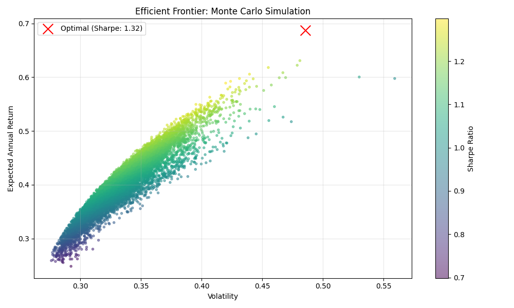
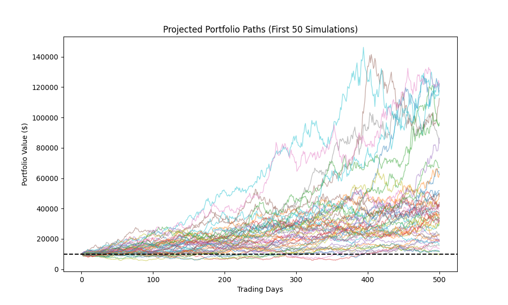
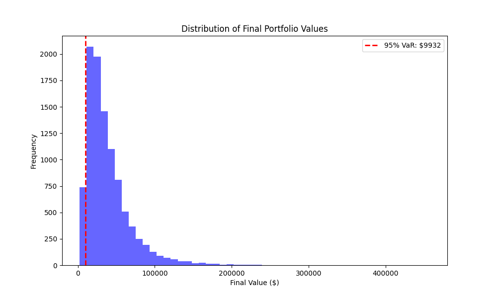
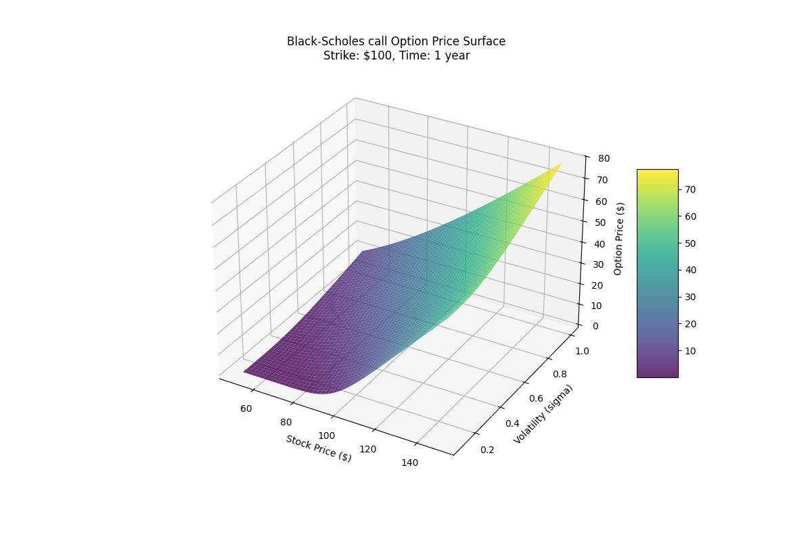
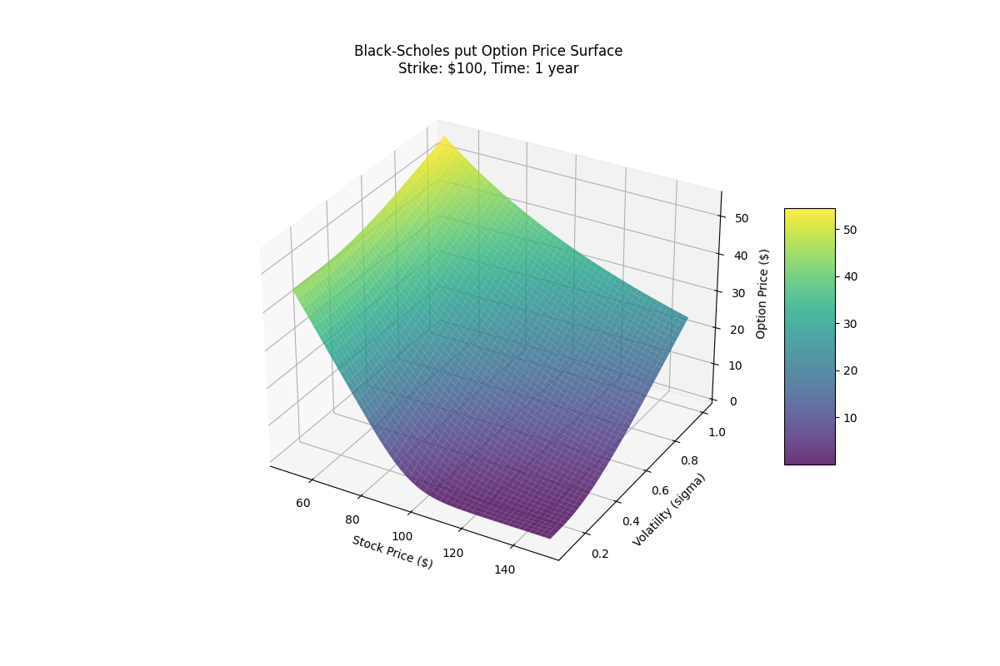

# Quantitative Portfolio Optimization Engine


## 📌 Overview
This project is a comprehensive quantitative finance toolkit that combines **Portfolio Optimization**, **Risk Management**, and **Derivatives Pricing**.

It uses Modern Portfolio Theory (MPT) to construct optimal asset allocations, employs **Monte Carlo Simulations** to quantify tail risk (VaR), and implements the **Black-Scholes Model** to generate 3D volatility surfaces for option valuation.

## 🚀 Live Demo
**[Click here to view the Interactive Dashboard](https://portfolio-optimization-engine-pxhjpfyv8tj5jxinbn9qr3.streamlit.app/)**

## ⚡ Quick Overview
* **Portfolio Optimization & Risk:** Optimizes portfolio weights to maximize the Sharpe Ratio.
* **Risk Management:** Simulates 1,000+ market scenarios to calculate Value at Risk (VaR).
* **Options Pricing:** Prices European options and visualizes the Volatility Surface.

## 🛠️ Tech Stack
* **Core Logic:** `Python`, `NumPy`, `Pandas`, `SciPy`
* **Visualization:** `Plotly` (Interactive Charts), `Matplotlib`
* **Dashboard:** `Streamlit`
* **Testing:** `Pytest`

## 💻 Installation
1. Clone the repository:
   ```bash
   git clone https://github.com/eddiesung111/portfolio-optimizer-engine.git
   ```
2. Create a virtual environment:
   ```bash
   python3 -m venv .venv
   source .venv/bin/activate
   ```
3. Install dependencies:
   ```bash
   pip install -r requirements.txt
   ```

## 🛡️ Module 1: Portfolio Optimization & Risk
**Goal:** Construct the "Efficient Frontier" portfolio that offers the highest expected return for a given level of risk.
### 💻 How to Run
```bash
python main.py
```
### 📊 Methodology & Results

#### Optimization (Efficient Frontier)

The project solves the following optimization problem:
   
$$\text{Maximize  } S_p = \frac{E[R_p] - R_f}{\sigma_p}$$
     
Subject to:

   - Unity Constraint: $\sum_{i=1}^{N} w_i = 1$

   - Long-Only Constraint: $0 \leq w_i \leq 1$

#### Sample Output:
```text
OPTIMAL PORTFOLIO ALLOCATION (Max Sharpe: 1.32)
------------------------------------------------
TSLA : 68.97%
NVDA : 26.01%
GOOG : 5.01%
```

## 🛡️ Module 2: Risk Management (Monte Carlo)
Goal: Stress-test the optimized portfolio against thousands of potential future market paths using Geometric Brownian Motion (GBM).

### 💻 How to Run
```bash
python src/risk_manager.py
```

### 📊 Methodology & Results
We simulate stock price paths using the stochastic differential equation:

$$ dS_t = \mu S_t dt + \sigma S_t dW_t $$

- $S_t$: Asset Price
- $\mu$: Expected Return (Drift)
- $\sigma$: Volatility
- $dW_t$: Wiener Process (Random Walk)

#### Efficient Frontier Visualization
Maps the risk-return profile of random portfolios vs. the optimal allocation.


#### Monte Carlo Simulation (Projected Paths)
Uses Geometric Brownian Motion (GBM) with Cholesky Decomposition to model correlated asset paths over a 2-year horizon (10,000 iterations).


#### Risk Analysis (Value at Risk)
A histogram of final portfolio values showing the 95% VaR threshold (the red dashed line).



## 📉 Module 3: Derivatives Pricing
Goal: Calculate theoretical prices for European Call/Put options and visualize market sensitivity (Greeks).

### 💻 How to Run
```bash
python src/options_pricer.py
```
Opens an interactive 3D plot window.

### ⚙️ 📊 Methodology & Results

Implements the closed-form Black-Scholes Model:

$$ C = S_0 N(d_1) - K e^{-rT} N(d_2) $$

Where $N(\cdot)$ is the cumulative distribution function of the standard normal distribution. 

This module also generates a 3D Volatility Surface to visualize how option prices react to changes in underlying price and volatility.

1. Call Option Volatility Surface
Visualizes the relationship between Underlying Price, Volatility, and Call Price.


2. Put Option Volatility Surface
Visualizes the Put Price surface. Note the inverse relationship with stock price compared to the Call option.


## 🚀 The Dashboard
All three modules are integrated into a single interactive web application.
```bash
streamlit run dashboard.py
```

## 🧪 Testing
The project uses `pytest` to ensure mathematical accuracy (e.g., weights summing to 1.0, Put-Call Parity).
To run the full test suite:
```bash
pytest
```

## 📂 Project Structure
```text
portfolio-optimization-engine/
├── src/
│   ├── __init__.py           # Package marker
│   ├── data_loader.py        # Yfinance fetcher
│   ├── portfolio_optimizer.py# Mean-Variance Solver
│   ├── risk_manager.py       # Monte Carlo Engine
│   └── options_pricer.py     # Black-Scholes & 3D Plotting
├── tests/
│   ├── test_optimizer.py     # Optimizer tests
│   └── test_pricer.py        # Black-Scholes tests
├── results/
│   ├── monte_carlo_simulation.png
│   ├── final_value_distribution.png
│   └── option_surface.png
├── main.py                   # Orchestrator script
├── dashboard.py              # Main Streamlit Application
├── requirements.txt          # Dependencies
└── README.md                 # Project Documentation      
```

## ⚠️ Disclaimer
This software is for educational purposes only. Past performance is not indicative of future results.
